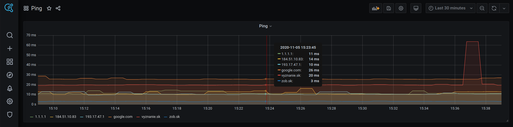

-
dNation Ping is a transparent tool for pinging selected IP addresses or domain names in set intervals with results displayed on graph.



## Getting Started 
### Prerequisites

* [Docker](https://www.docker.com/)
* [Docker-compose](https://docs.docker.com/compose/) **>= *v3.0*** / [Kubernetes](https://kubernetes.io/)

### Installation

```bash
umask 0022
git clone https://git.ifne.eu/dnation/ping.git
```

#### Docker-Compose

* Add user to group `docker`, logout/login if necessary

```bash
# Is used in docker group?
groups | grep docker
... docker

# Launch
cd ping/docker
chmod a=rwx prometheus/prometheus
docker-compose up -d

# Debugging
docker-compose logs | grep EROR
```


#### Kubernetes
```bash
helm install dnation-ping ./k8s
```

## Usage
After installation:
* http://localhost:3001/
* Username: `admin`
* Password : `pass`

## Modifications
### docker-compose

| env variable | what it represents |
| :--- | :--- |
| ADMIN_USER | grafana UI username |
| ADMIN_PASSWORD | grafana UI password |
| PING_PORT | default grafana UI port |

* **Edit pinging targets**

    - Edit targets in /docker/prometheus/targets.json file *(don't use vim file editor)*
    - Save file
    - Applied changes should appear in GUI within 5 minutes period
    
### kubernetes

* **See k8s/values.yaml file for possible modifications**    
    
### More Info
**Kubernetes related**

 - *nodePort is used to expose Grafana UI (30071) and Prometheus UI (30909)*

## Built With

* [Prometheus](https://prometheus.io/)
* [Blackbox-exporter](https://github.com/prometheus/blackbox_exporter/blob/master/README.md)
* [Grafana](https://grafana.com/)


