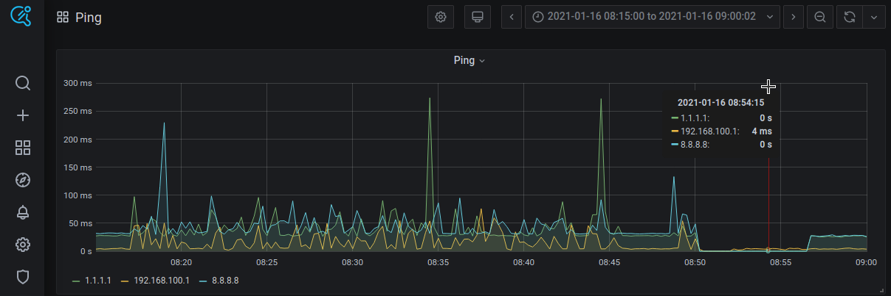

# Understanding measured values



Image above contains 2 different types of measured values at `2021-01-16 08:54:15` timestamp:
1. `192.168.100.1: 4 ms`: last pong reply from `192.168.100.1` was received after `4 ms`; it happened at or before the timestamp mentioned above
2. `1.1.1.1: 0 ms`: no pong reply (to last ping request) was received from `1.1.1.1` within 9.50 seconds; timeout ran out at or before the timestamp mentioned above

Under certain circumstances, you may also observe `1.1.1.1:` (no value, a gap) case. This happens when Prometheus's time is not synchronized with system clock, e.g. when you run using Virtual Machine and use "restore from snapshot" feature which causes system clock to "jump" ahead. In such case you can restart containers to fix this issue:
```
cd ping/docker
docker-compose down
docker-compose up -d
```

# Debugging
